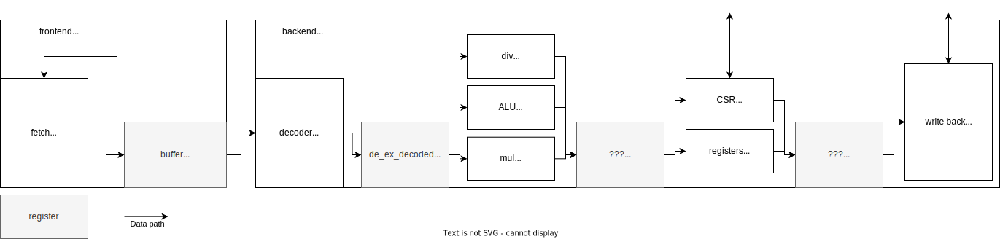
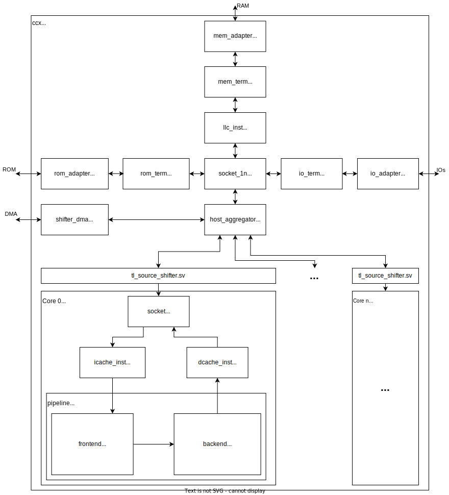
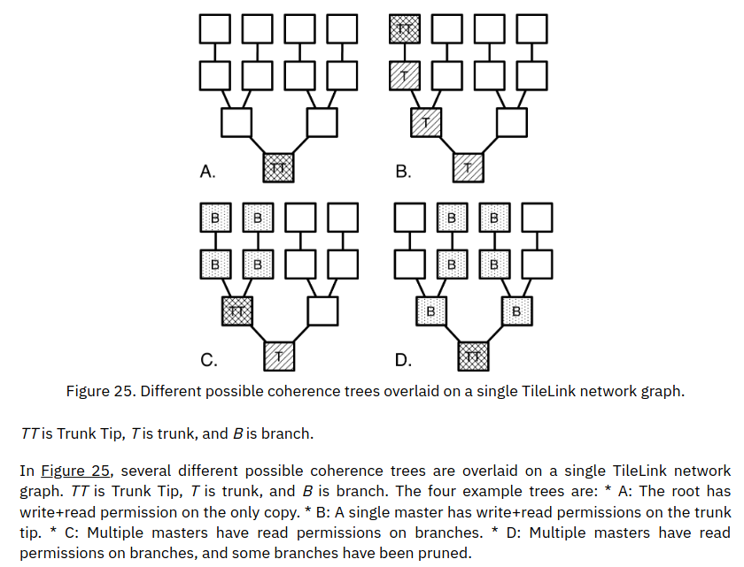
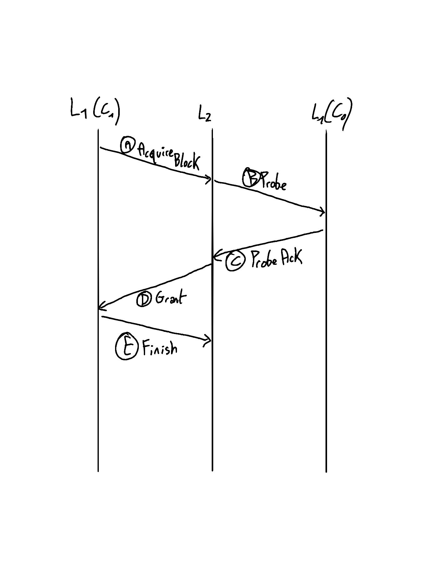

# Rapport de stage 3A

## Introduction

## Choix du coeur RISC V

### NOELV

### Muntjac

## Prise en main du coeur

Muntjac est un coeur RISC V capable de lancer Linux. Le coeur est constitué du pipeline, d'un cache de données et d'un cache d'instructions. Le pipeline est lui-même divisé en un frontend et un backend

### Protocole TileLink

Le protocole TileLink reprend le protocole AXI, mais ajoute de la cohérence de cache mais ajoute des canaux pour assurer une communication entre les différents niveaux de cache du SoC.

* Canal A : Requête d'une ligne de données d'un maître à un esclave
* Canal B : Requête d'une ligne de données d'un esclave à un maître
* Canal C : Réponse à la requête B
* Canal D : Réponse à la requête A
* Canal E : Confirmation de la fin de la transaction

L'intérêt des canaux B et C est d'assurer la communication entre les coeurs de même niveau. Par exemple, si le L1 de C0 souhaite une donnée qui est stockée dans le L1 de C1:

Un système de permission est également implémenté. Les différents niveaux de permission sont les suivants:

* None : Le noeud ne contient pas la donnée, et ne peut donc ni l'écrire ni la lire.
* Trunk : Le noeud contient la donnée en cache, et est sur le chemin d'accès. Il ne peut ni la lire ni l'écrire
* Branch : Le noeud contient la donnée en cache, mais ne peut que la lire.
* Tip : Le noeud est au bout d'un tronc. Il a les permissions de lecture et d'écriture sur la data.

Exemple :

### Implémentation des GPIO

Sur le SoC fait par l'université de Cambridge, les leds et les switchs ne sont pas implémentés. Pour permettre un debug